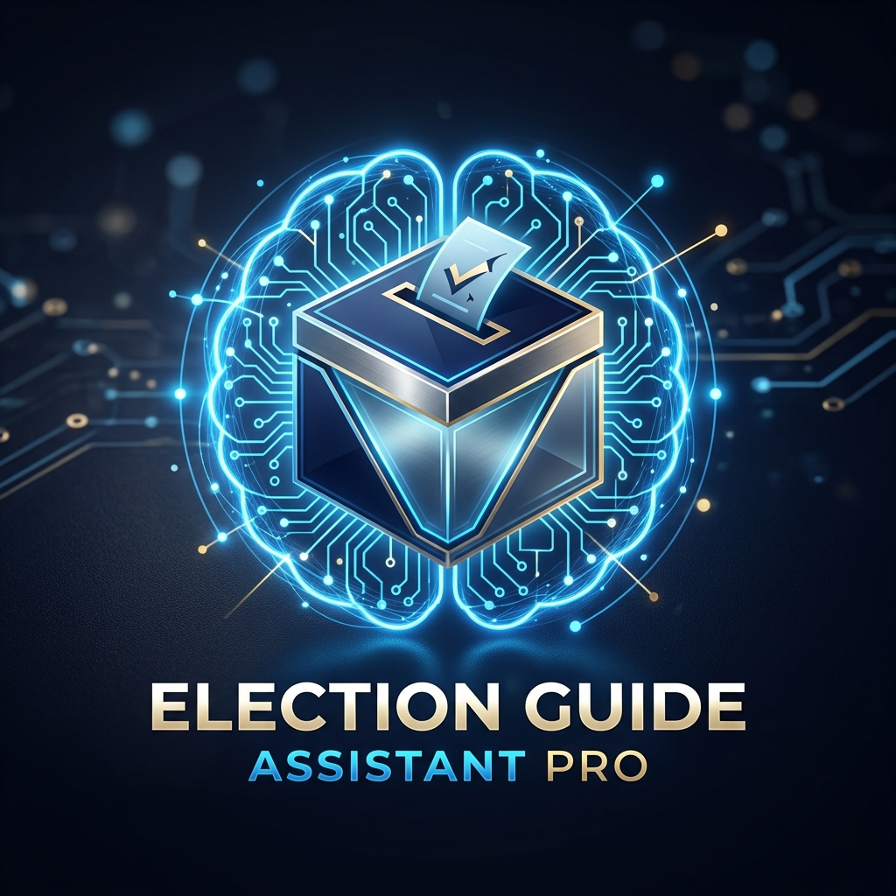

# Election Guide Assistant Pro 🗳️🎓

**Election Guide Assistant Pro** is a premium, interactive AI mentor designed to educate citizens about the democratic election process. Built with a "teacher-first" philosophy, it breaks down complex political and administrative concepts into simple, engaging, and transparent steps.



## 🌟 Overview

Navigating the election process can be overwhelming. This assistant serves as a personal guide, helping users understand everything from voter registration to the final declaration of results. Whether you're a first-time voter or a seasoned citizen looking for technical depth, the assistant adapts its teaching style to match your needs.

## ✨ Key Features

### 1. Interactive Mentor Interface
- **Dynamic Conversations**: A smooth, chat-like experience where the "Mentor" guides you through each stage.
- **Micro-Animations**: Features "thinking" indicators and smooth transitions to feel alive and responsive.
- **Adaptive Content**: The mentor changes its language based on your selected expertise level.

### 2. Personalized Learning Modes
- **Beginner Mode**: Uses simple analogies and easy-to-understand language.
- **Deep Dive Mode**: Focuses on technical details, behind-the-scenes logistics, and security measures.
- **First-Time Voter Mode**: A practical, step-by-step guide on what to do exactly when you reach the polling booth.

### 3. Knowledge Levels
- **Novice**: For those new to the election system.
- **Intermediate**: For users who know the basics but want more context.
- **Advanced**: For users looking for legal references (e.g., Article 324, RP Act) and technical specifications.

### 4. Interactive Election Timeline
- A visual progress tracker at the bottom of the screen monitors your journey through the 9 critical stages:
  1. Announcement
  2. Registration
  3. Nomination
  4. Campaigning
  5. Silence Period
  6. Voting (EVM & VVPAT)
  7. Security
  8. Counting
  9. Result Declaration

### 5. Knowledge Checks (Quizzes)
- Interactive quizzes at the end of key stages to reinforce learning.
- Instant feedback with detailed explanations for every answer.

### 6. Premium Aesthetics
- **Modern Design**: Built with a sleek, dark-themed glassmorphism aesthetic.
- **Responsive Layout**: Works seamlessly across desktops, tablets, and mobile devices.
- **Vibrant UI**: Uses a curated color palette (Royal Blue, Emerald Green, and Gold accents) to convey trust and authority.

## 🛠️ Tech Stack

- **Structure**: Semantic HTML5
- **Logic**: Vanilla JavaScript (ES6+ Class-based architecture)
- **Styling**: Modern CSS3 (Flexbox, Grid, Custom Variables, Keyframe Animations)
- **Data**: JSON-structured content for easy scalability

## 📂 Project Structure

```text
ElectionAssisstant/
├── index.html      # Main application structure & SEO meta tags
├── styles.css      # Core design system, animations & responsive rules
├── script.js       # ElectionMentor engine & state management
├── data.js         # Central repository for stages, quizzes & UI strings
└── logo.png        # Brand asset
```

## 🚀 How to Run

1.  **Clone or Download** the repository to your local machine.
2.  Open `index.html` in any modern web browser (Chrome, Firefox, Edge, Safari).
3.  Choose your **Knowledge Level** and **Guidance Mode** to start your interactive journey!

---

Developed with ❤️ to empower every citizen.
